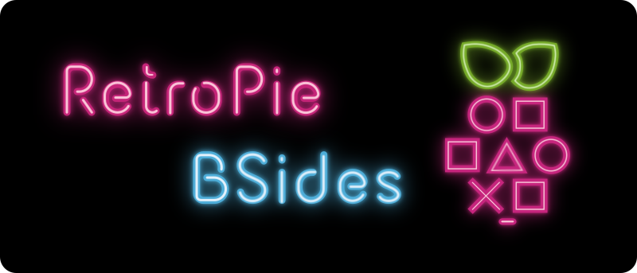

<h1 align="center">
  
  <br>
</h1>

<p align="center">
  <a href="#installation-and-usage">Installation</a> •
  <a href="#what-do-i-find-at-the-bsides">What is in the box?</a> •
  <a href="#other-tricks">What else is to discover?</a> •
</p>

---

Welcome to RetroPie BSides an add-on repository to your existing RetroPie installation. This repo contains a few scriptmodules, but it will be expanded over time. In majority it holds my contributions I made in the RetroPie forum. However, if you have an orphaned scriptmodule: Your contribution is welcome.  
The scriptmodules come with extensive documentation or a Mini How-To on how to handle it. You can find it on this website or at the header of each script file.

**Why the Title RetroPie-BSides?**

Sometimes, at the hey-days of vinyl records, you could find gems on the B side of a music album, which may have given you more joy than the hits from the A side. This is also how this repo works: You will need a little time to discover the B side, but chances are you find a gem.

## Installation and Usage

On your RetroPie-Setup:

```bash
cd ~/RetroPie-Setup/ext
git clone --depth 1 https://github.com/Gemba/RetroPie-BSides bsides
cd bsides
git sparse-checkout set --no-cone scriptmodules
```

To update:

```bash
cd ~/RetroPie-Setup/ext/bsides
git pull
```

For usage see subsequent sections:

- [Game Ports](#game-ports)
- [Emulators and Libretro Cores](#emulators-and-libretro-cores)
- [Supplementary Modules](#supplementary)


## What do I find at the BSides?

To avoid name collision some packages from this repo contain the `rb_` prefix but they will replace the RetroPie scriptmodule with the same name. E.g., `rb_jzintv` will replace `jzintv`.

### Game Ports

The actual games/ROMs are not included for copyright/license reasons. You can find them on the internet and also how to get a license. I have got mine from GOG.com and humblebumble.com.

#### Baba Is You

  
Installation: [Mini How-To](docs/Baba_Is_You.md) • Scriptmodule: [Source](scriptmodules/ports/babaisyou.sh)

#### Papers, Please

  
Installation: [Mini How-To](docs/Papers_Please.md) • Scriptmodule: [Source](scriptmodules/ports/papersplease.sh)

#### Head over Heels

  
Installation: [Mini How-To](docs/Head_over_Heels.md) • Scriptmodule: [Source](scriptmodules/ports/hoh.sh)

#### Edna Bricht Aus (Edna & Harvey: The Breakout)

  
Installation: [Mini How-To](docs/Edna_Breakout.md) • Scriptmodule: [Source](scriptmodules/ports/ednabreakout.sh)

### Emulators and libretro-cores

#### Libretro Core of AppleWin emulator (lr-applewin)

  
Installation: [Mini How-To](docs/Libretro_Applewin.md) • Scriptmodule: [Source](scriptmodules/libretrocores/lr-applewin.sh)

#### Intellivision Emulator (rb_jzintv)

This is a drop-in replacement, it will de-install the official RetroPie scriptmodule.

  

Installation: [Mini How-To](docs/Jzintv.md) • Scriptmodule: [Source](scriptmodules/emulators/rb_jzintv.sh)

### Supplementary Tools

#### Enhanced Bash Welcome on Login (rb_bashwelcome)

This is a drop-in replacement, it will de-install the official RetroPie scriptmodule.

  

Installation: [Mini How-To](docs/Bashwelcome.md) • Scriptmodule: [Source](scriptmodules/supplementary/rb_bashwelcome.sh)

## Other Tricks

These are not maintained via scriptmodule as they either do not fit into the one-size-fits approach of a scriptmodulel all or are one-off scripts. They may come in handy.

### Arcade DT

A Joystick/Gamepad driver without custom kernel module or C-code. 


What's the hack? Customize existing device-tree kernel-modules to read input from the GPIO. Fast & lowest inputlag. [Arcade DT](https://github.com/gemba/arcade-dt) has all the details. 

### Game 'Donut Dodo' Controller Mapping Helper

If you own the game [Donut Dodo](https://zapposh.itch.io/donut-dodo-retropie-edition) you may notice that the joystick mapping does not work in some cases. 


The script addresses this issue by editing the Donutdodo mapping file outside of the game to remap the buttons (shown in green above) to your RetroPie controller configuration. See the comments and hints in [the gist](https://gist.github.com/Gemba/bb54d2b6fb086ae239c8add50471b001) itself for usage. 

There is a catch: Unfortunately there is no Donut Dodo binary for 64 bit RaspiOS yet.

### To be continued ...

In the meantime you may browse the [RetroPie-Extra](https://github.com/Exarkuniv/RetroPie-Extra/) repo it hosts broad set of scriptmodules.

