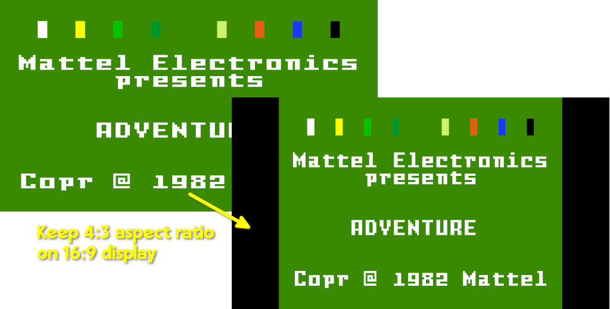

## How-To for 'jzIntv' Scriptmodule

Intellivision emulator with 16:9 aspect ratio fix  

**Additional Notes**

This is a drop-in replacement for the jzintv scriptmodule of RetroPie. The emulator/module id is `rb_jzintv` in contrast to the original `jzintv` in cass you have to adjust the emulator selection in the _Runcommand_ menu of RetroPie. This release fixes these issues:
1. Correct aspect ratio to 4:3 (as on old TV sets) even if connected to a modern 16:9 display. The game will be pillarboxed, i.e. with black bars on left and right. See also initial discussion at RetroPie forum: https://retropie.org.uk/forum/topic/32433
2. Fix a UI freeze on Raspberry Pi Models 3 when a mouse is also connected
3. Fix the compile on multiarch RaspiOS installations (i.e., aarch64 and armhf) due to a SDL2 upstream bug present in pre-Trixie installations.

**Execute Scriptmodule to Deploy Content**

`sudo ~/RetroPie-Setup/retropie_packages.sh rb_jzintv`

